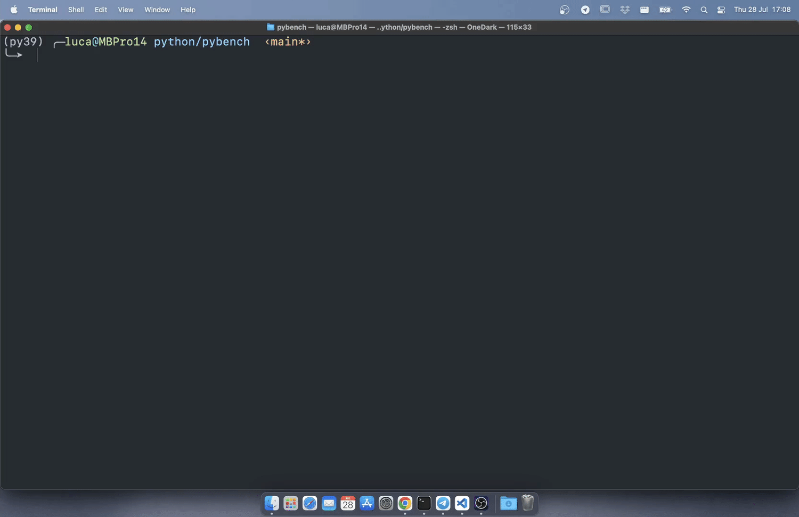
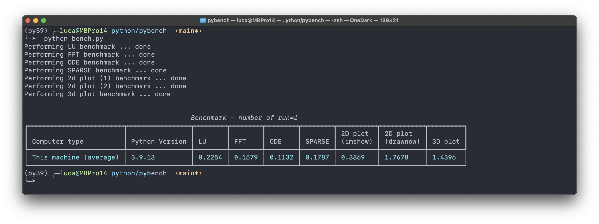
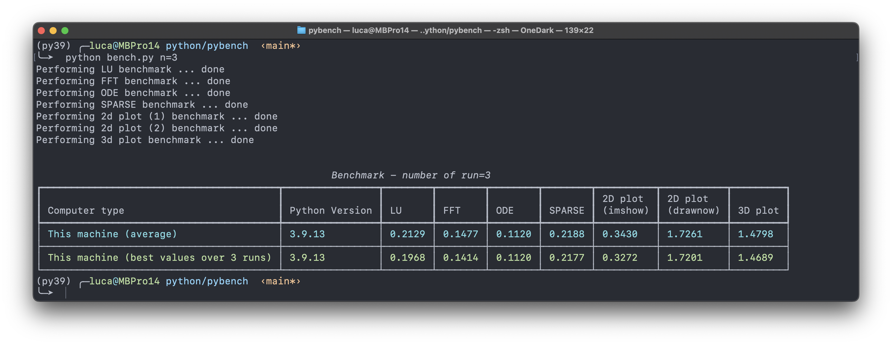
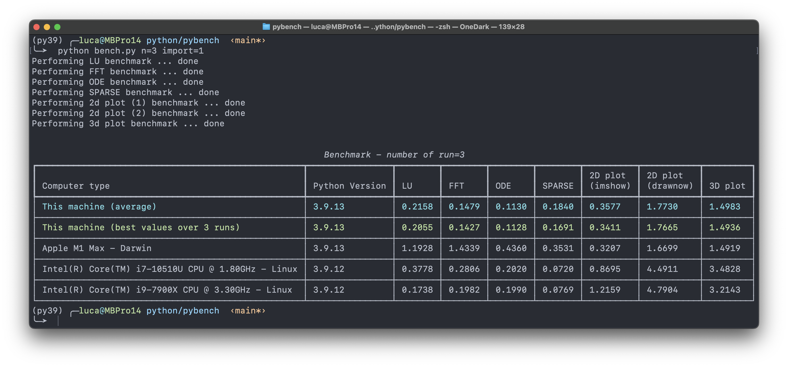
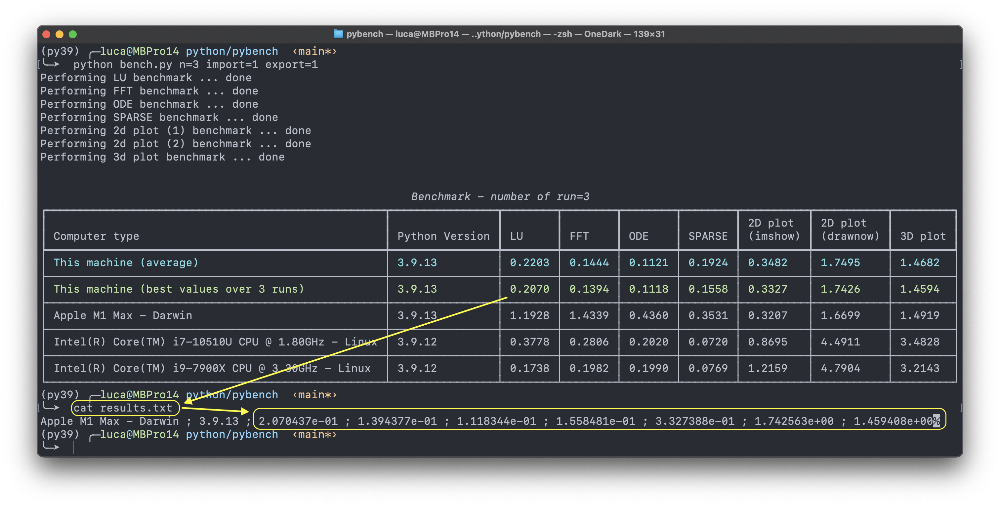

# pybench

This project provides a single file `bench.py` that is inspired to the `bench.m` function available in MATLAB&reg;.

Seven tasks are tested:
* LU factorization
* FFT Fast Fourier Transform
* ODE Ordinary diff. eqn.
* SPARSE Solve sparse system
* 2-D plot involving the use if "imshow"
* 2-D plot involving the use if "drawnow"
* 3-D plot involving the use if "mplot3d"



<p align="center">
(<i>disclaimer</i>: the gif is accelerated by a factor of 4 with respect to the real execution time)
</p>


## 1. Installation

Clone the repository:

```bash
git clone https://github.com/giaccone/pybench.git
```

and run the script `bench.py` with a python interpreter having this modules installed:

* py-cpuinfo
* numpy
* scipy
* matplotlib
* drawnow
* rich

## 2. Usage

Simply run the script

```bash
python bench.py <options>
```

available options:

* `n`: an positive integer representing the number of times each task is executed (default is 1)
* `export`: boolean 0 or 1. If set to 1 the script exports the best results of each task on a file called `results.txt` (default is 0)
* `import`: boolean 0 or 1. If set to 1 the script import the results of other machines collected in the file `other-results.txt` (default is 0)

## 3. Examples

### 3.1 Single run

```bash
python bench.py
```



### 3.2 Multiple run

With optional parameter `n` it is possible to set the number of times each task is executed. The following example makes use of `n=3`.

```bash
python bench.py n=3
```



### 3.3 Add other results for comparison

With optional parameter `import` it is possible include in the output results of other machine previously tested and saved on the file `other-results.txt`. The repository currently include a file with the results of three different machines.

```bash
python bench.py n=3 import=1
```



### 3.4 Export results

With optional parameter `export` it is possible export the (best) results of the machine under test in a file called `results.txt`. The content of this file can be copied in the file `other-results.txt` for future comparisons.

```bash
python bench.py n=3 import=1
```


